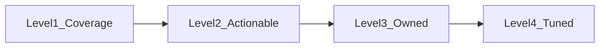

## A progression, not a scorecard

Use this ladder to discuss **where a service team is today** and **what the next step is**. It is normal to be at different rungs for different services.

| Rung | You have… | Typical gap |
|---|---|---|
| **1: Coverage** | Detectors exist for top user-visible paths | High noise, unclear thresholds |
| **2: Actionable** | Every alert has **runbook** or **dashboard** link | Recipients still too broad |
| **3: Owned** | **Primary** on-call mapping and escalation | Muting used informally |
| **4: Tuned** | Regular review of **alert rates**, **SLO** alignment | Continuous improvement |

{}
In a workshop, ask pairs to **place their real service** on the ladder and pick **one** move to the next rung; this turns the deck into a concrete retro.
{}

---

**Next:** [Noise, severity, and ownership](2-noise-ownership/)
